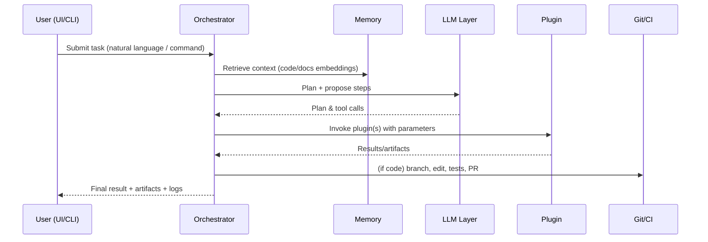
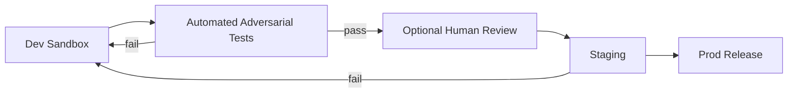

# Friday Architecture Specification (Final Draft)

**Style:** Monolithic core with a **plugin architecture** (local-first, single-machine), extensible via well-defined plugin APIs.  
**Environments:** Dev = **WSL + VS Code** · Staging = **Docker containers** · Prod = **Hybrid (Windows/Linux)**  
**UI:** Any modern JavaScript framework (no hard requirement).

---

## 1. Architectural Principles

- **Local-first & Single-Machine:** Favor offline operation. Network access is opt-in via config.  
- **Monolithic Core + Plugins:** A stable **Core Kernel** exposes APIs; capabilities are delivered as **Plugins** (load/unload at runtime).  
- **Deterministic Pipelines:** All actions flow through the **Orchestrator** (plan → act → verify → log).  
- **Safety & Auditability:** Every tool call and filesystem/network action is permission-checked and logged.  
- **Separation of Concerns:** The **Ops Module** (anonymity/cyber-ops) is separate, sandboxed, and optional-by-config.  
- **Portability:** Same codebase runs in Dev (WSL), Staging (Docker), Prod (Windows/Linux).  

---

## 2. High-Level System Diagram

```mermaid
flowchart TD
    UI[Frontend UI (Modern JS)] -->|commands/events| ORCH[Core Orchestrator]
    CLI[CLI (WSL/Windows)] --> ORCH
    ORCH -->|LLM prompts| LLM[LLM Layer (Claude + Ollama)]
    ORCH -->|read/write| MEM[Memory Layer (ChromaDB + SQLite + Cloud)]
    ORCH -->|invoke| PLUGINS[Plugin Host]
    PLUGINS --> OS[OS Automation]
    PLUGINS --> WEB[Web Automation]
    PLUGINS --> SOC[Social Media]
    PLUGINS --> VOICE[Voice I/O]
    PLUGINS --> OPS[Ops Module (Anon/Sec)]
    ORCH --> LOGS[Observability (Logs/Telemetry)]
    subgraph Monolithic Core
      ORCH
      LLM
      MEM
      PLUGINS
      LOGS
    end
```

---

## 3. Core Components

### 3.1 Core Kernel (Monolith)
- **Responsibilities:** lifecycle, configuration, permissions, policy enforcement, logging, plugin loading, task routing.
- **Interfaces:** 
  - `TaskAPI` (submit tasks, track state, cancel), 
  - `PluginAPI` (register tools, declare capabilities), 
  - `PolicyAPI` (capability/allowlist checks), 
  - `MemoryAPI`.
- **Tech:** Python (primary), Node optional for UI dev server.

### 3.2 Orchestrator
- Planning (ReAct-style), tool selection, retry/backoff, success criteria checks, and result collation.
- Enforces **promotion pipeline** for self-mod: dev → sandbox → adversarial → (optional) human → staging → prod.

### 3.3 LLM Layer
- **Primary:** Claude Code.  
- **Local Models (Ollama):** OpenHermes, Mistral, CodeLlama, Nous-Hermes (tool/routing based on task type & latency).  
- **Routing:** small-fast local for drafts; Claude for reasoning/edits; code-model for refactors.

### 3.4 Memory Layer
- **Vector:** ChromaDB (code, docs, pages embeddings).  
- **Relational:** SQLite (state, runs, approvals).  
- **Cloud/Long-term:** Supabase / Softr / GibsonAI/Memori (archival, recall).  
- **Policy:** credentials never written to disk; volatile-only secret store.

### 3.5 Plugin Host
- **Load/Unload:** entry points discovered via `plugins/available/` directory scanning by `PluginLoader`.
- **Isolation:** per-plugin config + allowlists; filesystem/path sandboxes.
- **Contracts:** idempotent operations; declare side-effects; structured outputs.
- **Implementation:** `plugins/plugin_loader.py` provides runtime plugin discovery, loading, unloading, and tool invocation.
- **Available Plugins:** `os_hello` (basic greeting functionality for system health checks).

### 3.6 Ops Module (Separate)
- **Anonymity & Cyber-ops:** VPN/proxy chains, Tor, traffic shaping, IP spoofing (where legal), nmap/scapy/ZAP.  
- **Sandboxing:** Docker network namespaces; target scopes from `security/targets.yaml`.  
- **Default:** present and available; gated by strict config & audit.

### 3.7 UI / Voice
- **Frontend:** any modern JS framework; exposes: approvals, toggles, logs, resource view, console.  
- **Voice:** Push-to-talk only; persona controls; TTS/ASR pluggable (Waver/Vosk/Whisper).

---

## 4. Key Data Flows

### 4.1 Task Execution (User → Result)


### 4.2 Self-Modification Promotion Pipeline


---

## 5. Environments & Deployment

- **Dev (WSL + VS Code):** single-process monolith + hot-reload; local Ollama; Claude via CLI; local Chroma/SQLite.  
- **Staging (Docker):** services as containers (core, memory, UI, ops) on a single host; docker-compose; seed data.  
- **Prod (Hybrid):** single-machine on Windows or Linux. Optional Windows UI + Linux services via WSL/Docker.

**Config Profiles:** `config/dev.yaml`, `config/staging.yaml`, `config/prod.yaml` (toggle modules, routes, resources).

---

## 6. Observability & Policy

- **Logs:** `./data/logs/` (JSONL). Redact secrets.  
- **Telemetry:** CPU/GPU/mem/disk via psutil; expose `/metrics` (optional).  
- **Policy Engine:** deny-by-default; allowlists per plugin (files, domains, commands).  
- **Approvals:** always via PR for code; UI approves social posts; destructive ops prompt.

---

## 7. Plugin Contracts (Interface Sketch)

```python
class Plugin(Protocol):
    id: str
    version: str
    capabilities: list[str]

    def describe_tools(self) -> dict: ...
    def invoke(self, tool: str, **kwargs) -> dict: ...
```
- **Side-effects:** must declare filesystem/network impact.
- **Retry/Backoff:** plugin should be idempotent or handle dedupe tokens.
- **Schema:** inputs/outputs validated (pydantic).
- **Discovery:** Plugins placed in `plugins/available/` with optional `PLUGIN_METADATA` dict and `create_plugin()` factory function.
- **Loading:** `PluginLoader` class handles discovery, instantiation, and lifecycle management.
- **Example:** `os_hello` plugin demonstrates the basic interface with a simple greeting tool.

---

## 8. Directory Layout (Reference)

```
friday-ai-assistant/
  core/                 # kernel + orchestrator
  plugins/              # plugin packages (os, web, social, voice, ops)
  ui/                   # frontend (any JS framework)
  memory/               # db adapters
  security/             # sandbox config, targets.yaml
  config/               # dev.yaml, staging.yaml, prod.yaml
  data/
    logs/               # JSONL logs
    exports/            # scraped/processed data
  docs/                 # specs (.md for Claude)
  tests/                # unit/e2e
```

---

## 9. Risks & Mitigations

- **Model Drift / Bad Edits:** mitigated by promotion pipeline + PR reviews.  
- **Resource Contention:** throttle on user activity; job queue w/ priorities.  
- **Security Exposure:** strict allowlists, sandboxing, cryptographic checks.  
- **Vendor Lock-in:** local-first design + abstracted adapters.

---

## 10. Acceptance Criteria

- End-to-end task runs via UI and CLI.  
- Plugins load/unload without restart.  
- Self-mod pipeline gates code changes into staging then prod.  
- Logs show complete provenance for any action.  
- Works in Dev (WSL), Staging (Docker), and Prod (Windows/Linux).

---

**End of Architecture Specification.**
