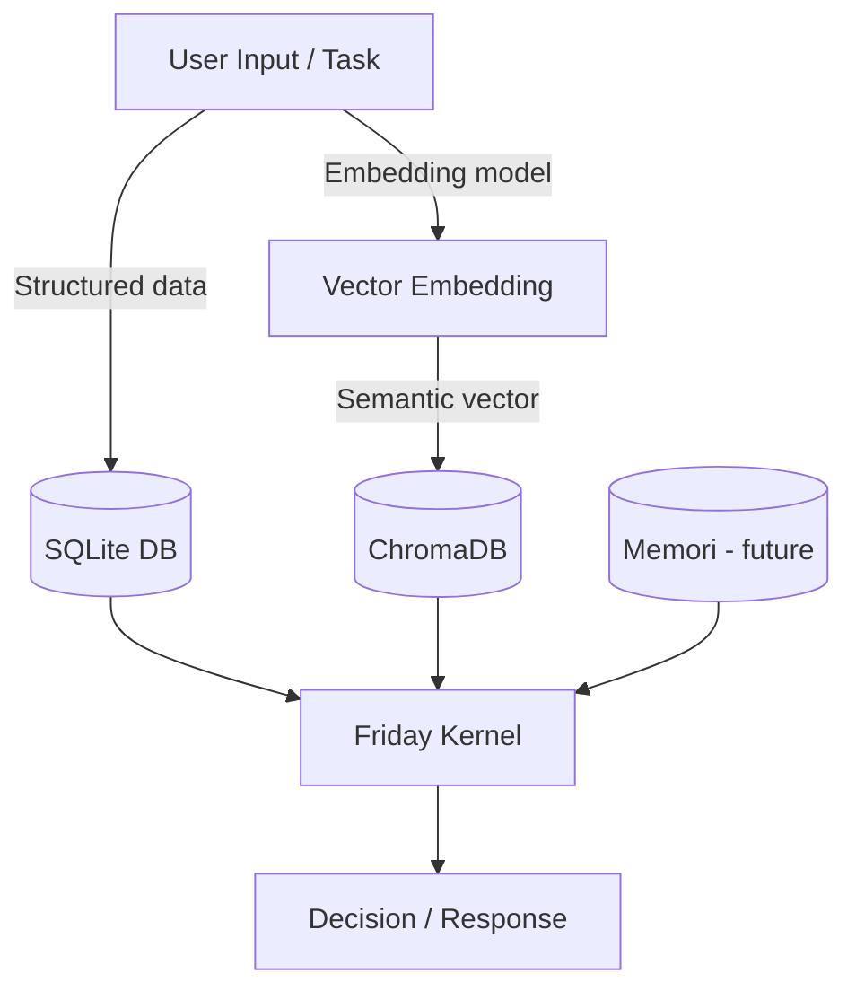

# 🧠 Friday AI Assistant – Memory Architecture

## 1. Overview
Friday’s memory system is layered to balance **structured persistence**, **semantic recall**, and **future cognitive growth**.  
The design ensures modularity: each layer can evolve independently while still feeding into the unified Friday Kernel.

---

## 2. Memory Layers

### **Layer 1 – SQLite (Structured Memory)**
- **Purpose:** Persistent storage for structured data.  
- **Contents:**  
  - Task metadata (IDs, descriptions, status)  
  - Logs and audit trails  
  - User/system configuration  
- **Characteristics:**  
  - Relational schema  
  - ACID-compliant  
  - Fast queries for exact matches  

---

### **Layer 2 – ChromaDB (Semantic Memory)**
- **Purpose:** Vector storage for semantic embeddings and retrieval.  
- **Contents:**  
  - Summaries of conversations  
  - Documents or knowledge base embeddings  
  - Semantic tags for tasks and plugins  
- **Characteristics:**  
  - Stores embeddings (numerical vector representations)  
  - Similarity search (cosine / dot product)  
  - Supports RAG (retrieval-augmented generation)  
- **Data Flow:**  
  - Input (text → embedding model → vector)  
  - Stored in `data/memory/chroma_dev/`  
  - Queried via semantic similarity  

---

### **Layer 3 – Future: Memori (Episodic/Cognitive Memory)**
- **Purpose:** Long-term, human-like memory (episodic, self-reflection).  
- **Contents:**  
  - Events, decisions, “life history” of Friday  
  - Self-modifications and reasoning logs  
- **Characteristics:**  
  - External plugin-based  
  - More experimental; optional layer  
- **Integration Plan:**  
  - Friday will sync SQLite (facts) + Chroma (semantics) with Memori (episodes).  

---

## 3. Data Flow Diagram

---

## 4. Integration Strategy  

1. **Phase 1 (Done):** SQLite implemented for structured memory.  
2. **Phase 2 (Now):** Enable ChromaDB for embeddings.  
   - Install missing dependencies (`onnxruntime`, `tokenizers`, etc).  
   - Configure path `data/memory/chroma_dev/`.  
   - Add embedding pipeline via Ollama/OpenAI/HF.  
3. **Phase 3 (Future):** Add Memori as a plugin for episodic memory.  

---

## 5. Example Use Cases  

- **SQLite:**  
  “List all tasks I started last week.”  
- **ChromaDB:**  
  “What did we discuss about Docker setup?” (semantic recall)  
- **Memori (future):**  
  “Remind me of the time you failed to start because of missing PyAudio.” (episodic memory)  

---

## TODO: ChromaDB Integration

- Current status: SQLite integration complete and functional.
- ChromaDB has been installed and tested successfully, but is not yet fully integrated.
- Rationale for postponement:
  - Claude is actively generating core system and test files.
  - Adding new files/tests prematurely could cause divergence.
- Next steps (future milestone):
  1. Revisit `dev.yaml` memory section (already has placeholders for `chroma_path` and `vector` config).
  2. Add a `ChromaMemoryAdapter` implementation in `memory/`.
  3. Update kernel initialization to conditionally enable ChromaDB.
  4. Write corresponding unit/integration tests under `tests/unit/test_chroma.py`.
  5. Verify coexistence of SQLite (structured storage) + ChromaDB (vector/semantic storage).

**Note:** No immediate action required. Safe to defer until core system scaffolding is stabilized.
